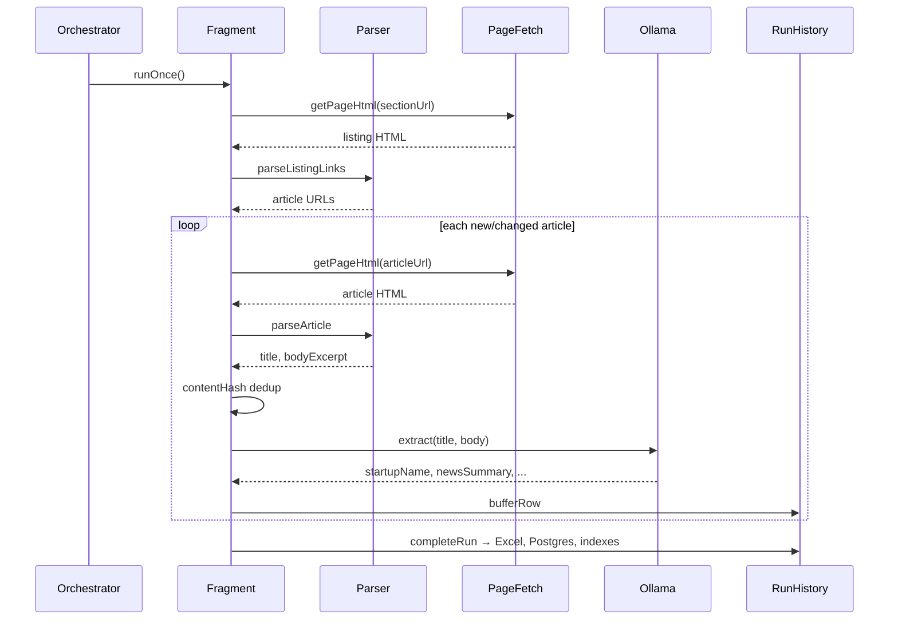

# Architecture

Developer and reviewer guide for the AgriTech Startup Discovery Tracker.

## Purpose

This system **discovers agrifood/agtech startups from public news sources**, extracts structured fields with a local LLM, and stores them for analysis. It is a **batch crawler**, not a real-time API or web app.

Design goals:

- **Standalone** — public npm packages only; no monorepo or private registry coupling
- **Source-pluggable** — new sites added by new modules, not by editing shared pipelines
- **Incremental** — avoid re-fetching and re-inferring unchanged content
- **Resilient extraction** — failed or incomplete LLM output is retried on later runs
- **Observable** — every run produces JSON logs and a summary

## High-level structure

```
┌─────────────────────────────────────────────────────────────┐
│                    AgriTechJobsOrchestrator                  │
│  One scheduler → sequential job runs → stagger delay         │
└────────────┬───────────────────────────────┬────────────────┘
             │                               │
     ┌───────▼────────┐              ┌───────▼────────┐
     │ AgfunderJob    │              │ Inc42Job       │
     │ runOnce()      │              │ runOnce()      │
     └───────┬────────┘              └───────┬────────┘
             │                               │
     ┌───────▼────────┐              ┌───────▼────────┐
     │ Agfunder       │              │ Inc42          │
     │ Fragment       │              │ Fragment       │
     └───────┬────────┘              └───────┬────────┘
             │                               │
             └──────────────┬────────────────┘
                            │
              ┌─────────────▼─────────────┐
              │ Shared services            │
              │ PageFetch, Ollama,         │
              │ RunHistory, Postgres, Excel│
              └────────────────────────────┘
```

### Layer responsibilities

| Layer | Role | Examples |
|---|---|---|
| **Orchestrator** | When jobs run; stagger spacing; graceful shutdown | `dependencies.ts` |
| **Jobs** | Thin adapter: enabled check + invoke fragment once | `agfunder-news-job-manager.ts` |
| **Fragments** | Full per-source crawl pipeline | `agfunder-news-fragment.ts` |
| **Parsers** | HTML / snapshot → title, links, body text | `agfunder.parser.ts`, `inc42.parser.ts` |
| **Integrations** | External I/O without business rules | Ollama, HTTP, agent-browser |
| **Persistence** | Storage and dedup indexes | Excel, Postgres, url index |
| **Domain** | Pure types and rules | dedup hashes, extraction validation |
| **Constants** | Configurable literals per source | section seeds, CSS selectors |

## End-to-end flow (one article)



### Incremental crawl strategy

1. **Section snapshot** — hash of article link list on a listing page; unchanged section → skip (except URLs flagged for re-extract)
2. **URL content index** — per-article content hash; same hash → skip unless `extractionComplete: false` or Postgres has empty summary
3. **In-run dedup** — `entryKey` prevents duplicates within one run

This minimizes HTTP traffic and LLM calls.

## Orchestrator and scheduling

Previous design gave each job its own `JobScheduler`, causing parallel weekly timers. The orchestrator now owns **one timer** and runs jobs **serially**:

```typescript
// Pseudocode
onInterval(AGRITECH_DEFAULT_INTERVAL_MS):
  for job in enabledJobs:
    await job.runOnce()
    await sleep(JOB_STAGGER_DELAY_MS)  // except after last job
```

**Why serial + stagger?**

- Browser profiles (Inc42) and Ollama are resource-heavy; overlap causes contention
- Stagger makes logs and failure isolation clearer
- Matches the pattern used in larger job orchestrators (delay between job starts)

**Extension point:** add a new job by implementing `ICrawlJobManager` and appending it to `resolveEnabledJobs()` in `dependencies.ts`.

## Source architecture (Open/Closed Principle)

Each source is a **vertical slice**:

```
constants/<source>.ts   → seeds, host rules, selectors
parsers/<source>.parser.ts
fragments/<source>-fragment.ts
jobs/<source>-job-manager.ts
```

Shared code is **closed for modification** when adding sources:

- `RunHistoryService`, `UrlContentIndexService`, `OllamaStartupExtractor`
- Domain dedup and `StartupNewsRow` shape
- Postgres schema (`source_id` column distinguishes rows)

New sources are **open for extension** without editing fragments of other sources.

### Fetch strategies per source

| Source | Listing fetch | Article fetch |
|---|---|---|
| AgFunder | HTTP | HTTP |
| Inc42 homepage / IPO tracker | HTTP | HTTP |
| Inc42 agritech Datalabs | Headed browser + scroll + a11y snapshot | HTTP |

Login-gated feeds use **persistent browser profiles** under `profiles/<session>/`:

- Operator logs in once manually (`headed: true`)
- Automation reuses cookies in `browser-data/`
- Same conceptual model as LinkedIn feed automation, scoped to Inc42 in this repo

## Dependency injection

`AgriTechContainer` registers singletons lazily:

```
CONFIG → PAGE_FETCH → (AGENT_BROWSER if needed)
       → STARTUP_EXTRACTOR
       → RUN_HISTORY → EXCEL, URL_INDEX, SECTION_SNAPSHOTS, POSTGRES
       → *_JOB_MANAGER
```

Fragments receive interfaces (`IStartupNewsExtractor`, `PageFetchService`) — not concrete globals — which keeps unit tests and future swaps feasible.

## LLM extraction contract

Ollama returns JSON:

- `isRelevant` — article about a specific startup?
- `startupName`, `startupWebsite`
- `description` — only if **explicitly stated** in article (no inference)
- `newsSummary` — required when relevant; factual summary of the news event

`isCompleteExtraction()` gates persistence: relevant rows without `startupName` + `newsSummary` are **not saved** and are **retried** on the next run.

## Persistence model

Postgres and Excel mirror the same two datasets:

| Store | Key / behavior | Purpose |
|---|---|---|
| `agritech.news` / `agritech-news.xlsx` | `entry_key` (upsert) | Startup rows from all sources |
| `agritech.logs` / `agritech-logs.xlsx` | append-only | Per-article crawl events + `run_complete` |

When both backends are enabled, each run upserts news and appends logs to Postgres and the two Excel files in parallel.

## Clean code practices in this codebase

1. **Single responsibility** — parsers parse; fragments orchestrate; jobs only delegate
2. **No magic strings in logic** — literals live in `constants/`
3. **Pure domain helpers** — `dedup.ts`, `extraction.ts` have no I/O
4. **Explicit config** — Zod-validated env in `app-config.ts`; defaults in `constants/app.ts`
5. **Fail visibly** — crawl actions logged to `agritech.logs` / `agritech-logs.xlsx` with reasons (`skipped`, `error`, `not_relevant`)
6. **Minimal scope changes** — shared abstractions only where two sources already need them (`ICrawlJobManager`, parser interfaces)
7. **Tests on pure logic** — parsers, dedup, extraction validation, JSON parsing

## Testing strategy

- **Unit tests** — parsers, dedup, Ollama JSON parsing, extraction rules
- **No live network in CI** — HTML fixtures embedded in tests
- **Build gate** — `tsc` + Jest on every change

## Deployment modes

| Mode | Command | Use case |
|---|---|---|
| One-shot | `AGRITECH_RUN_ONCE=true` | Cron, manual test, Docker `compose run` |
| Long-running | `npm start` | Local daemon with weekly loop |
| Docker stack | `docker compose up` | Postgres + app; Ollama on host |

## Future extensions (conceptual)

- **New HTTP source** — copy AgFunder slice; register job
- **New login-gated source** — copy Inc42 browser listing pattern; new profile dir
- **Per-source interval** — extend orchestrator config with optional overrides (not implemented; global interval today)
- **Webhook / API export** — add persistence adapter; fragments unchanged

## File map (quick reference)

```
src/dependencies.ts          Orchestrator entry
src/di/container.ts          Service wiring
src/jobs/*.ts                ICrawlJobManager implementations
src/fragments/*.ts           Crawl pipelines
src/parsers/*.ts             Source-specific parsing
src/persistence/*.ts         Storage + indexes
src/integrations/*.ts        Ollama, HTTP, browser
src/domain/*.ts              Types + pure logic
src/config/app-config.ts     Env schema
```
